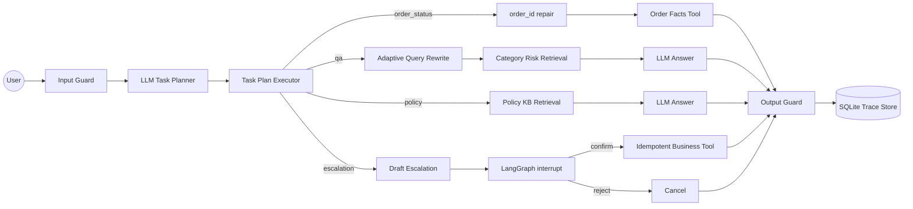

# E-Commerce Support & Operations Agent

面向电商客服/运营场景的业务 Agent 项目，使用 **FastAPI + LangGraph + OpenAI-compatible LLM + MCP + deterministic tools + public datasets** 实现。项目目标不是做一个通用聊天机器人，而是展示生产级 Agent 开发中的关键能力：意图拆解、Agentic RAG、企业工具接入、HITL 副作用治理、可恢复执行、审计轨迹和可量化评测。

## 业务场景

典型用户输入：

```text
查订单 203096f03d82e0dffbc41ebc2e2bcfb7 的状态；如果已经延迟且低分，生成客服跟进话术，确认后创建售后升级 case。
```

系统支持四类业务能力：

| Route Intent | 场景 | LLM 负责 | 确定性工具负责 |
|---|---|---|---|
| `order_status` | 精确订单状态、配送、支付、评价查询 | 识别用户是否在查订单、抽取 order_id | 从订单事实索引读取可信业务数据 |
| `qa` | 类目运营风险、物流风险、低分评价分析 | 将业务问题转成类目检索需求并生成分析口径 | 从全量订单聚合结果中检索类目风险 |
| `policy` | 退款、取消、发票、支付、账号、配送时效、补偿边界 | 基于检索到的政策段落生成客服回答 | 从 markdown policy KB 检索相关章节 |
| `escalation` | 售后升级、退款/补偿申请、取消订单、改地址、发票申请、创建 case | 判断副作用意图、生成可审核草稿 | 幂等执行对应企业工具，必须经过 HITL 确认 |

这个边界是面试中的核心：**LLM 处理自然语言不确定性，业务事实、权限、副作用和状态迁移交给确定性系统**。

## 兜底策略

项目实现了分层 fallback，而不是把失败都丢给大模型重试：

| 层级 | 已实现策略 | 业务意义 |
|---|---|---|
| 输入风控 | LLM guard 失败时启用启发式 guard，覆盖常见 prompt injection、越权、破坏性 SQL/代码请求；普通客服问题放行 | LLM API 抖动时客服链路仍可用，但不替代生产级策略风控 |
| 任务规划 | LLM planner 失败或返回非法 intent 时，使用多意图拆解器生成降级任务计划 | 避免因为规划模型失败导致全链路不可用 |
| 参数抽取 | LLM slot extractor 失败时，用 regex 抽取/归一化 32 位 order_id 和类目别名 | 订单查询这种高确定性任务不依赖模型 |
| 工具参数 | `repair_order_id` 处理空格、大小写、前缀、不完整、多 ID，并返回结构化错误 | 非法参数让 Agent 修复或澄清，不反复报错 |
| RAG 检索 | 类目检索按 exact -> token overlap -> adaptive rewrite；policy 未命中则转人工 | 保证召回可解释，检索失败有安全出口 |
| LLM 生成 | QA/policy answer 生成失败时返回 grounded template，只展示已检索事实/章节 | 防止编造，优先保证事实可用 |
| 副作用动作 | 售后升级/退款/取消/改地址/发票必须 HITL 确认，工具使用幂等 key | 防重复、避免误发券/误建单/误取消 |
| 输出风控 | 输出 guard 拒绝空输出、占位符、traceback；失败记录 trace | 防止坏结果直接返回用户 |
| 审计追踪 | 正常、输入拒绝、输出拒绝都写入 SQLite trace | 方便复盘、评测飞轮和线上排障 |

## 数据来源

项目使用两类公开数据，不把手写小样本当作真实数据。

1. **Olist Brazilian E-Commerce Public Dataset**

原始来源：[Kaggle Olist Brazilian E-Commerce Public Dataset](https://www.kaggle.com/datasets/olistbr/brazilian-ecommerce)。原始 CSV 下载到 `data/olist_raw/`，不提交到仓库。

原始表包括订单、订单明细、支付、评价、商品、商家、用户、类目翻译等。构建脚本会离线 join 和聚合，生成：

```text
data/olist_derived/
├── order_facts_index.json    # 98,666 条全量订单事实，用于精确订单查询
├── category_risk_index.json  # 73 个类目聚合，用于运营风险/RAG
├── agent_records.json        # 518 条分层抽样记录，用于轻量 demo
├── eval_cases.jsonl          # 245 条任务评测集
└── deepeval_rag_cases.jsonl  # DeepEval/RAG 评测导出
```

`category risk` 不是“类目危险”，而是从业务数据里计算出的运营风险画像，例如延迟率、低分率、取消率、平均延迟天数、平均评分、平均支付金额和样例订单。真实本地生活/电商业务里也会有类似指标，只是实体从 `category/order/seller` 换成 `store/package/SKU/coupon`。

2. **Bitext Customer Support Dataset**

原始来源：[Bitext customer-support-llm-chatbot-training-dataset](https://github.com/bitext/customer-support-llm-chatbot-training-dataset)。原始 CSV 下载到 `data/bitext_raw/`，不提交到仓库。

该数据集包含约 27k 条英文客服意图样本，覆盖订单、退款、发票、支付、配送、账号、投诉、人工客服等 27 个细粒度 intent。构建脚本生成：

```text
data/bitext_derived/
├── intent_eval_cases.jsonl       # 1,080 条意图路由评测，每个 intent 40 条
├── multi_intent_eval_cases.jsonl # 60 条多意图组合评测
└── metadata.json                 # 数据血缘、类目分布、支持 intent 列表
```

这部分用于补齐“真实客服语言多样性”，让项目不只会处理 Olist 的订单 ID 和类目名。

3. **ResCommons Full Ecom Chatbot Dataset**

原始来源：[rescommons/Full-Ecom-Chatbot-Dataset](https://huggingface.co/datasets/rescommons/Full-Ecom-Chatbot-Dataset)。这是 MIT 许可的公开电商客服/Agent 数据，包含 44,031 条样本，覆盖 product discovery、order management、returns、tool-use、RAG-grounded QA 等场景。项目下载 train/test Parquet 到 `data/rescommons_raw/`，不提交原始文件。

构建脚本生成：

```text
data/rescommons_derived/
├── support_corpus.jsonl                 # 35,213 条 train 语料，作为客服对话/RAG 检索库
├── hybrid_retrieval_eval_cases.jsonl    # 500 条 test query，用于离线检索评测
└── metadata.json                        # response_type、intent、capability 分布
```

这里故意只用 train split 作为 corpus，test split 作为 eval query，避免把测试样本直接放回检索库造成虚高指标。

4. **V1rtucious Ecom Chatbot Test Set**

原始来源：[V1rtucious/Ecom-Chatbot-Test-Set](https://huggingface.co/datasets/V1rtucious/Ecom-Chatbot-Test-Set)。这是 MIT 许可的 2,000 条电商 chatbot synthetic test set，专门覆盖 tool-calling、RAG 和 escalation。项目下载 test Parquet 到 `data/v1rtucious_raw/`，构建：

```text
data/v1rtucious_derived/
├── ecom_agent_eval_cases.jsonl  # 2,000 条标准电商 Agent 测试样本
└── metadata.json
```

当前 profile：

```text
response_type: text 1172, tool_call 828
intent_category: product_discovery 667, order_management 667, escalation 666
group: A 667, B 667, C 666
```

它的下载量不高，不能当“经典 benchmark”吹；价值在于字段贴 Agent 评测，能补充 tool/RAG/escalation 分组样本。

## Agent 流程



当前实现偏 **workflow-constrained Agent**，不是完全自主 ReAct。原因是客服/运营场景有明确的业务边界和副作用风险：先由 LLM task planner 拆出有序任务计划，再由确定性 executor 按顺序执行；只读任务可以连续执行，遇到售后升级、退款、取消订单、改地址、发票等副作用任务时进入 HITL。HITL 不表示自动提权；它只是把“模型草稿”交给用户或人工坐席确认。确认后 executor 才会调用对应企业工具，本项目用本地幂等工具模拟 `open_support_case`、`refund_request`、`cancel_order`、`change_address` 和 `invoice_request`，生产中替换为 OMS/CRM/退款/优惠券 MCP tools。

## Agentic RAG

项目里有两条 RAG：

1. **结构化实体 RAG**：面向 Olist 类目/订单。类目检索先做 query rewriting，把 `health beauty`、`health-beauty`、`healthbeauty` 等用户写法统一到真实类目 `health_beauty`，再用 token overlap fallback 处理弱匹配。
2. **政策文档 RAG**：面向 `data/knowledge_base/support_policy.md`。按 markdown section 切分，检索退款、取消、补偿、发票、配送、人工审核等规则，回答时只允许使用命中的政策段落。
3. **客服对话 Hybrid Retrieval**：面向 ResCommons 35k train corpus。默认本地实现用 BM25 召回候选、字符 ngram 向量分数做 rerank，并在 test query 上评估 intent/capability 命中。当前 `/chat` 主链路已把 TopK 历史客服语料作为 QA/Policy 的补充上下文；生产版可替换为 Elasticsearch/BM25 + vector DB + learned reranker。

为什么当前没有强依赖 embedding：

- 订单 ID、类目名、政策标题是高精度实体和短文本，确定性归一化比 embedding 更可控、可解释、低成本。
- 对大量客服对话/FAQ，项目已经接入 ResCommons 做本地 hybrid baseline；生产版会把本地 BM25/字符向量替换为 Elasticsearch/BM25 + vector database + learned reranker。这个替换是工程实现差异，不是业务链路差异。

## MCP 接入

项目同时实现了 MCP server 和 MCP client adapter：

```bash
python -m app.mcp_server
```

本项目暴露的 MCP tools：

| Tool | 用途 |
|---|---|
| `get_order_status` | 查询订单状态、配送、支付、评价事实 |
| `search_category_risk` | 查询类目运营风险 |
| `draft_escalation` | 生成售后升级草稿 |

面试中要说清楚：**MCP 是工具上下文协议，不是多 Agent 协作协议**。生产里 Agent 会作为 MCP client 接企业 OMS/CRM/工单/优惠券/知识库等外部 MCP servers；本项目也把本地业务工具暴露成 server，方便外部 Agent 客户端复用和测试。

适合继续接入的外部 MCP：

| MCP | 协议/传输 | 鉴权 | 真实能力 | 是否接入本项目 |
|---|---|---|---|---|
| Stripe MCP | MCP over remote HTTP/Streamable HTTP | Stripe API key / OAuth | payments、refunds、customers、invoices、Stripe docs | 已补可选 adapter，适合 sandbox 演示退款副作用 |
| Shopify Order MCP | JSON-RPC HTTP；Shopify 文档还提到 UCP capability negotiation | JWT + shop/order scope | `get_order` 等订单查询能力，但受 agent tier/scope 限制 | 暂不强接，业务很贴但个人接入门槛高 |
| Zendesk MCP/action flows | Zendesk 文档强调 HTTP/OAuth，不支持 stdio | OAuth/API token | 工单、客服 action flow、人工升级生态 | 可作为后续客服工单接入 |
| PostgreSQL/MySQL MCP | 常见 stdio 或 Streamable HTTP | DB 凭证/内网鉴权 | 企业订单事实、商家规则、工单状态 | 当前用 Olist deterministic tools 模拟，生产替换价值高 |
| Filesystem/GitHub MCP | 常见 stdio | 本地权限/GitHub token | policy markdown、商家规则仓库、SOP 版本 | 可选，适合规则版本管理 |

个人项目拿不到企业真实 OMS/CRM 凭证是正常的，但可以用公开 MCP server + demo account 验证协议打通，用本地 MCP server 模拟企业工具 schema、权限、幂等和副作用治理。

本项目新增了 `RemoteMcpToolClient` 和 `StripeMcpAdapter`：

```text
app/mcp_client.py   # stdio + remote Streamable HTTP MCP client
app/stripe_mcp.py   # Stripe payment/refund MCP adapter
```

这不是把 Stripe 当作最终业务系统，而是用它验证外部 SaaS MCP 的接入形态。进入真实企业后，Stripe adapter 的位置会被公司内部 OMS/CRM/refund/coupon MCP 替换，Agent graph、HITL、trace、幂等和工具 schema 治理都可以复用。

## 副作用治理

售后升级、补偿、取消订单、改地址、发券、发票申请都属于有副作用动作。项目采用三层保护：

- **意图侧**：Bitext intent mapping 标记 `side_effect_risk`，把投诉、退款、取消、改订单、人工客服等归入 `escalation`。
- **执行侧**：LangGraph `interrupt()` 在调用副作用工具前暂停，必须确认后才继续。
- **工具侧**：工具调用用幂等 key，重复确认不会重复创建业务 case/退款单/取消单。

当前支持的副作用动作：

| action_type | 真实系统映射 | 当前实现 |
|---|---|---|
| `open_support_case` | CRM/Zendesk/工单系统 | `CASE-...` 幂等工单 |
| `refund_request` | 支付/退款系统，如 Stripe 或企业财务工具 | `REFUND-...` 幂等申请 |
| `cancel_order` | OMS 订单取消接口 | `CANCEL-...` 幂等申请 |
| `change_address` | OMS/物流改地址接口 | `ADDR-...` 幂等申请 |
| `invoice_request` | 发票/财务系统 | `INV-...` 幂等申请 |

## 可观测性与回放

每次 `/chat` 请求都会写入 SQLite trace，记录 session、route intent、用户输入、最终回答、来源、状态和延迟。项目提供两个在线调试接口：

```text
GET /observability/summary
GET /observability/traces/{session_id}?limit=20
```

这不是完整监控平台，但已经覆盖面试中最关键的问题：能按 session 回放一次 Agent 轨迹，能看路由分布、失败状态和延迟分布。生产中可以把同一份 trace 事件同步到 Kafka/RocketMQ 审计流，再接 Prometheus/Grafana 或 OpenTelemetry。

## 评测结果

所有本地评测默认不需要真实 API key，适合 CI 和面试现场演示。LLM planner/judge eval 单独放到 `eval-llm`。

```bash
.\.venv\Scripts\python.exe -m pytest
.\.venv\Scripts\ruff.exe check app evaluation scripts tests
.\.venv\Scripts\python.exe -m evaluation.intent_eval
.\.venv\Scripts\python.exe -m evaluation.multi_intent_eval
.\.venv\Scripts\python.exe -m evaluation.task_eval
.\.venv\Scripts\python.exe -m evaluation.rag_retrieval_eval
.\.venv\Scripts\python.exe -m evaluation.hybrid_retrieval_eval
.\.venv\Scripts\python.exe -m evaluation.v1rtucious_eval_profile
.\.venv\Scripts\python.exe -m evaluation.knowledge_eval
.\.venv\Scripts\python.exe -m evaluation.tool_repair_eval
.\.venv\Scripts\python.exe -m evaluation.performance_eval
.\.venv\Scripts\python.exe -m evaluation.agent_metrics_report
```

当前本地结果：

| 指标 | 结果 | 含义 |
|---|---:|---|
| Unit/Integration Tests | 45 passed | 覆盖主流程、MCP、RAG、参数修复、trace、多意图执行、LLM fallback、副作用动作分发、HITL 状态清理、guard fallback、副作用排序和跨子任务槽位继承 |
| Ruff | All checks passed | 代码静态检查通过 |
| Olist task eval | 245/245, 100% | 订单/类目/升级 gold cases 均能被事实索引支持 |
| Bitext intent mapping | 1,080/1,080, 100% | 27 个客服 intent 到业务 route intent 的确定性映射正确 |
| Multi-intent decomposition | exact/contains/order/side-effect 均为 80% | 验证一句话多意图拆解，不漏副作用任务，不重复执行同类任务；当前离线 fallback 仍是主要改进点 |
| Category RAG exact_underscore | Top1 41.67% | 只支持原始下划线类目名，真实用户写法容易失败 |
| Category RAG token_overlap | Top1 77.22%, Recall@3 80.56% | 能处理空格/连字符，但 compact alias 仍会失败 |
| Category RAG adaptive_rewrite | Top1 100% | 当前主链路使用，覆盖下划线/空格/连字符/紧凑写法 |
| ResCommons hybrid retrieval | BM25 intent@5 81%, char-ngram intent@5 91%, hybrid intent@5 91% | 35k train corpus + 100 条 test query 的本地快速评测，已接入 `/chat` QA/Policy 主链路 |
| V1rtucious eval profile | 2,000 cases; text 1,172; tool_call 828 | 专门覆盖 product_discovery/order_management/escalation |
| Policy KB retrieval | Top1/Recall@3/MRR@3 100% | 中文政策问题能命中正确 policy section |
| Tool argument repair | 6/6, 100% | order_id 大小写、空格、前缀、缺失、不完整、多 ID 均可处理 |
| Deterministic latency | order p95 0.002ms, category p95 0.274ms, policy p95 0.825ms, escalation p95 0.002ms | 不含 LLM 网络延迟，衡量本地工具层性能 |
| Layered metrics report | 60+ metrics | 规划、工具、RAG、端到端轨迹、答案质量、安全、性能和可观测性总表，见 `evaluation/agent_metrics_report.md` |

LLM 评测：

```bash
OPENAI_API_KEY=<your-key>
OPENAI_BASE_URL=https://api.deepseek.com
OPENAI_MODEL=deepseek-v4-flash
LLM_EVAL_LIMIT=20
python -m evaluation.intent_planner_eval
```

也支持：

```bash
RUN_LLM_ROUTER_EVAL=1 LLM_EVAL_LIMIT=20 python -m evaluation.intent_eval
```

DeepSeek 可以跑，因为 `langchain-openai` 支持 OpenAI-compatible API。需要记录 provider、model、temperature、prompt version、评测日期，避免把不同模型的数字混在一起。

低成本 live smoke：

```bash
OPENAI_API_KEY=<your-key>
OPENAI_BASE_URL=https://api.deepseek.com
OPENAI_MODEL=deepseek-v4-flash
LIVE_SMOKE_OFFSET=2
LIVE_SMOKE_LIMIT=1
python -m evaluation.live_agent_smoke
```

最近一次小样本验证：`deepseek-v4-flash` 不支持 native `response_format`，项目会自动降级到 JSON-text structured fallback，再用 Pydantic 做本地 schema 校验。复合任务 live smoke 结果为 `tasks=['order_status', 'policy', 'escalation']`，`statuses=['completed', 'completed', 'awaiting_confirmation']`，`hitl=True`，`output_valid=True`。

LLM-as-Judge 小样本：

```bash
OPENAI_API_KEY=<your-key>
OPENAI_BASE_URL=https://api.deepseek.com
OPENAI_MODEL=deepseek-v4-flash
LLM_JUDGE_LIMIT=3
python -m evaluation.llm_judge_eval
```

最近一次小样本结果：category risk、policy boundary、multi-intent HITL 三类样本均通过，answer relevance / faithfulness / tool correctness / HITL correctness 四项均分 `5.00/5`，pass rate `100%`。这是低成本 smoke 级 judge，不等价于大规模线上评测。

网页控制台说明：左侧按钮只是预设输入模板，方便现场演示；点击发送后会调用真实 `/chat` API。页面顶部 `/runtime/status` 会显示当前是 `offline_workflow` 还是 `live_llm_agent`，只有用真实 key 启动服务时才是 live LLM。

项目也导出了 DeepEval 兼容 case，并预留 Ragas/TruLens 指标口径。相关框架：

- [DeepEval](https://deepeval.com/docs/metrics-introduction)：answer relevancy、faithfulness、contextual precision/recall、tool correctness。
- [Ragas](https://docs.ragas.io/en/stable/)：RAG answer correctness、context precision、context recall、faithfulness。
- [TruLens RAG Triad](https://www.trulens.org/getting_started/core_concepts/rag_triad/)：context relevance、groundedness、answer relevance。

## 快速开始

```bash
uv sync --extra dev
uv run python scripts/download_olist_data.py
uv run python scripts/build_olist_dataset.py
uv run python scripts/build_bitext_dataset.py
uv run --extra data python scripts/download_rescommons_parquet.py
uv run --extra data python scripts/build_rescommons_dataset.py
uv run --extra data python scripts/download_v1rtucious_eval.py
uv run --extra data python scripts/build_v1rtucious_eval.py
uv run python -m pytest
uv run uvicorn app.main:app --reload
```

DeepSeek/OpenAI-compatible 配置见 `.env.example`：

```text
OPENAI_API_KEY=your-key
OPENAI_BASE_URL=https://api.deepseek.com
OPENAI_MODEL=deepseek-chat
```

示例请求：

```bash
curl -X POST http://localhost:8000/chat ^
  -H "Content-Type: application/json" ^
  -d "{\"message\":\"退款补偿能不能直接承诺？\",\"session_id\":\"demo-policy\"}"
```

```bash
curl -X POST http://localhost:8000/chat ^
  -H "Content-Type: application/json" ^
  -d "{\"message\":\"帮我查一下订单 203096f03d82e0dffbc41ebc2e2bcfb7 的状态\",\"session_id\":\"demo-order\"}"
```

```bash
curl -X POST http://localhost:8000/chat ^
  -H "Content-Type: application/json" ^
  -d "{\"message\":\"订单 203096f03d82e0dffbc41ebc2e2bcfb7 延迟且低分，生成客服跟进话术\",\"session_id\":\"demo-case\"}"
```

## 项目结构

```text
app/
├── agent/          # LangGraph graph/state/business action nodes
├── intent/         # Bitext intent 到业务 route intent 的映射
├── llm/            # intent planner、guard、slot extractor、answer generator
├── olist/          # Olist index loader、业务工具、policy KB retrieval
├── tools/          # tool argument repair
├── config/         # dependency injection
├── mcp_server.py   # MCP tool server
├── mcp_client.py   # MCP client adapter
├── trace_store.py  # SQLite audit trace
└── main.py         # FastAPI entrypoint
scripts/
├── download_olist_data.py
├── build_olist_dataset.py
└── build_bitext_dataset.py
evaluation/
├── intent_eval.py
├── intent_planner_eval.py
├── task_eval.py
├── rag_retrieval_eval.py
├── knowledge_eval.py
├── tool_repair_eval.py
├── performance_eval.py
├── deepeval_export.py
└── deepeval_optional.py
data/
├── olist_derived/
├── bitext_derived/
├── rescommons_derived/
├── v1rtucious_derived/
└── knowledge_base/
tests/
```

## 面试讲法

一句话定位：

> 我做的是一个电商客服/运营 Agent，不是泛聊天 demo。它用 Olist 全量订单数据做事实层，用 Bitext 客服语料做意图覆盖，用 ResCommons 35k 客服对话做 hybrid retrieval corpus，用 V1rtucious 2k 测试集补 tool/RAG/escalation eval，用 markdown policy KB 做政策 RAG，用 LangGraph 实现 task planning、task execution、HITL 和 checkpoint recovery，并用 MCP 暴露/接入外部工具；所有关键链路都有离线评测。

容易被追问的问题和回答方向：

- **为什么不用完全自主 Agent？** 客服/运营动作有权限、合规和副作用，完全自主会增加成本和不可控性；我选择 workflow-constrained Agent，把不确定性限制在路由、抽槽、改写、总结里。
- **为什么 RAG 不一开始全用 embedding？** 订单 ID 查询必须走精确工具；类目名和政策章节需要可解释的 deterministic/hybrid retrieval；大量客服对话已经接入 ResCommons hybrid retrieval。生产版再把本地 BM25/字符向量替换为 ES + vector DB + learned reranker。
- **MCP 和多 Agent 协议有什么区别？** MCP 解决 Agent 调工具和拿上下文；A2A/Agent Card 解决 Agent 之间能力发现、任务委托和状态协商。这个项目重点是企业工具接入，因此 MCP 是必要层。
- **为什么接 Stripe MCP？** Stripe 不是最终 OMS，而是最适合个人项目验证真实外部 MCP + sandbox 副作用的 SaaS。它可以演示支付/退款类工具 schema、鉴权、HITL、幂等和 trace；生产里替换为企业内部退款/工单/优惠券 MCP。
- **副作用怎么防重复？** 路由侧识别风险意图，图执行侧 interrupt 等人工确认，工具侧幂等 key 防止重复创建 case。
- **怎么证明有效？** 用 Olist/Bitext/policy 三类评测集分别证明任务覆盖、意图覆盖、RAG 召回和工具鲁棒性；LLM judge 指标作为在线可选项，不替代确定性 CI。

## 下一步扩展

- 将本地 hybrid retrieval 替换为 Elasticsearch + vector database + learned reranker，并接入更多中文客服 FAQ/商家规则。
- 增加 tenant/seller ACL、优惠券/退款工具权限、预算限流和分布式 trace。
- 增加真实 LLM judge eval：用少量 DeepSeek/OpenAI-compatible key 测 answer relevancy、faithfulness、tool correctness，并把失败样本落盘进入回归集。
- 将 SQLite trace 替换为 MySQL/PostgreSQL + Kafka/RocketMQ 审计流，用于线上回放、成本统计和评测飞轮。

## License

MIT - see `LICENSE`.
