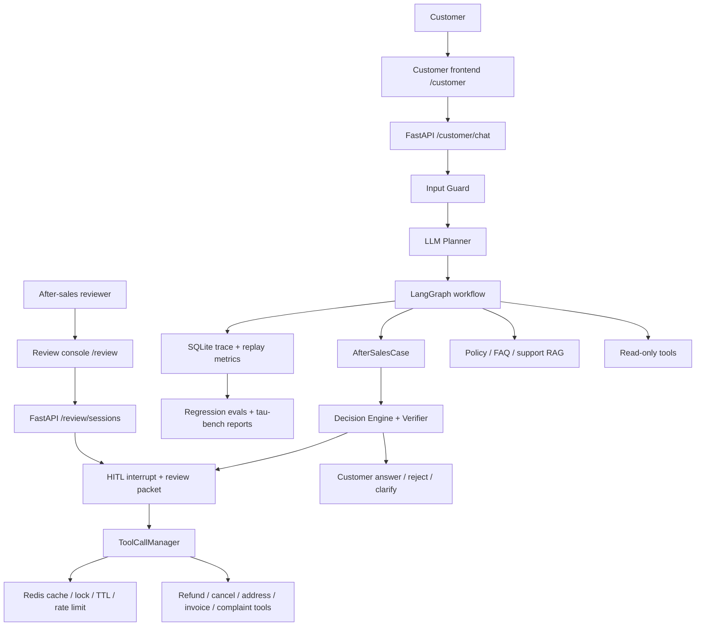

# commerce-support-agent

An e-commerce self-service after-sales agent with a staff review console for high-risk actions. It combines governed tool execution, workflow-constrained RAG, HITL approval, audit traces, and tau-bench retail evaluation.

The project focuses on a concrete business workflow: a customer asks about an order, refund, cancellation, address change, invoice, or complaint. The agent answers read-only questions directly, creates an after-sales case when a business action is needed, and turns risky write actions into asynchronous staff-review work. The UI is split into a customer self-service app and a staff review console; the backend remains a FastAPI API service.

## Highlights

- **Customer self-service + staff review**: order status lookup, policy Q&A, after-sales case creation, low-risk auto-handling, review queues, case status tracking, customer appeals, and HITL review for refunds, cancellations, address changes, invoices, and complaints.
- **LangGraph execution graph**: `plan_tasks -> select_next_task -> extract_slots -> retrieve_context -> execute_read_task/build_after_sales_case -> await_confirmation/finalize_escalation -> finalize_answer`.
- **Dialogue state tracking**: durable `active_order_id`, filled/missing slots, current intent, turn count, retrieved evidence counts, decision outcome, and handoff reasons.
- **Governed tool calls**: Pydantic schema validation, role/scope checks, customer order ownership guard, tenant-aware cache, async execution, timeout/retry/backoff, fallback, redacted audit logs, Redis side-effect locks, and SQLite idempotency records.
- **Workflow-constrained RAG**: Olist order facts, review-side risk profiles, markdown policy/FAQ/merchant rules, ResCommons support corpus, BM25 + local VectorStore fusion, and optional Qdrant backend.
- **MCP boundary**: local MCP server for business tools, stdio/remote MCP client adapters, and a Stripe sandbox adapter for external side-effect integration.
- **Evaluation-first development**: unit/integration tests, offline task and retrieval evals, product-flow regression, automated red-team checks, live LLM regression, LLM-as-judge smoke checks, and tau-bench retail local run.

## Architecture



More diagrams: [docs/ARCHITECTURE_DIAGRAMS.md](docs/ARCHITECTURE_DIAGRAMS.md)

## Data

The repository keeps derived lightweight artifacts and download/build scripts. Large raw datasets are not committed.

| Source | Use |
|---|---|
| Olist Brazilian E-Commerce Public Dataset | 98,666 order facts and 73 category risk profiles |
| Bitext customer support dataset | intent mapping and multi-intent evaluation |
| ResCommons Full Ecom Chatbot Dataset | support corpus and hybrid retrieval evaluation |
| V1rtucious Ecom Chatbot Test Set | tool/RAG/escalation profile cases |
| Local policy/FAQ/merchant rules | after-sales policy retrieval and decision grounding |

## Results

| Area | Result |
|---|---:|
| Unit/integration tests | 106 passed |
| Ruff | all checks passed |
| Customer product flow eval | 9/9 pass; auto-resolution 44.44%, handoff 55.56%, handoff precision 100%, policy grounding 100% |
| ResCommons retrieval | BM25 intent@1/intent@5 64%/81% -> hybrid 78%/91% |
| Category alias retrieval | realistic alias Top1 97.5% |
| Automated red-team eval | 8/8 pass; attack block 3/3, privacy block 2/2, unsafe write-claim block 8/8 |
| Safety regression | customer write confirmation blocked, review token/role/scope enforced, trace redaction tested |
| tau2-bench retail local run | pass^1 91.23% on retail base split, 114 tasks |

tau2 evidence: [benchmark_runs/tau2_retail/last_summary.md](benchmark_runs/tau2_retail/last_summary.md)

Full metrics: [evaluation/agent_metrics_report.md](evaluation/agent_metrics_report.md)
Customer flow evidence: [evaluation/customer_flow_eval_report.md](evaluation/customer_flow_eval_report.md)
Red-team evidence: [evaluation/red_team_eval_report.md](evaluation/red_team_eval_report.md)

## Quick Start

```bash
uv sync --extra dev
uv run python scripts/download_olist_data.py
uv run python scripts/build_olist_dataset.py
uv run python scripts/build_bitext_dataset.py
uv run --extra data python scripts/download_rescommons_parquet.py
uv run --extra data python scripts/build_rescommons_dataset.py
uv run python -m pytest -q
uv run uvicorn app.main:app --reload
```

Open:

```text
http://127.0.0.1:8000/
http://127.0.0.1:8000/customer
http://127.0.0.1:8000/review
```

Optional OpenAI-compatible LLM configuration:

```text
OPENAI_API_KEY=your-key
OPENAI_BASE_URL=https://api.deepseek.com
OPENAI_MODEL=deepseek-v4-flash
```

AIHubMix-style configuration is also supported:

```text
AIHUBMIX_API_KEY=your-key
OPENAI_MODEL=your-cheap-chat-model
```

Useful evaluation commands:

```bash
uv run python -m evaluation.customer_flow_eval
uv run python -m evaluation.red_team_eval
LIVE_AGENT_EVAL_LIMIT=8 uv run python -m evaluation.live_agent_eval
LLM_JUDGE_LIMIT=5 uv run python -m evaluation.llm_judge_eval
uv run python -m evaluation.agent_metrics_report
```

Docker Compose starts the app with Redis and Qdrant:

```bash
docker compose up --build
```

## Example Requests

```text
帮我查一下订单 203096f03d82e0dffbc41ebc2e2bcfb7 的状态
```

```text
退款补偿能不能直接承诺？
```

```text
给订单 203096f03d82e0dffbc41ebc2e2bcfb7 申请退款
```

```text
查订单 203096f03d82e0dffbc41ebc2e2bcfb7 状态，并说明退款政策，然后申请退款
```

Staff review endpoints:

```text
GET  /review/cases
GET  /review/sessions/{session_id}
POST /review/sessions/{session_id}/approve
POST /review/sessions/{session_id}/reject
```

Local review-console requests require `X-Review-Token: local-review-demo` by default.
Set `REVIEW_API_TOKEN` to override it.
Session trace replay uses the same token because it can contain redacted case-level debugging data.

Customer case endpoints:

```text
GET  /customer/cases/{case_id}
POST /customer/cases/{case_id}/appeal
```

## Repository Layout

```text
app/                 FastAPI app, LangGraph workflow, tools, MCP, RAG
benchmark_adapters/  tau2 retail adapter and guards
benchmark_runs/      persisted benchmark summaries
data/                derived sample data and local knowledge base
docs/                architecture, user manual, and bad-case regression notes
evaluation/          offline evals, live LLM evals, metrics reports
frontend/            customer self-service app and staff review console
scripts/             data builders and benchmark launchers
tests/               unit and integration tests
```

## Documentation

- [User manual](docs/USER_MANUAL.md)
- [Architecture diagrams](docs/ARCHITECTURE_DIAGRAMS.md)
- [Bad-case regression notes](docs/BAD_CASE_REGRESSION.md)
- [Metrics report](evaluation/agent_metrics_report.md)

## Scope

This is a public-data project for self-service support and after-sales review workflows. Customer-facing requests are constrained to the current account's orders, and internal traces/review packets are only available through the staff review boundary. The production integration points are represented through MCP adapters, Redis runtime coordination, SQLite traces, and deterministic tool interfaces. Enterprise deployment would replace the Olist-backed services with internal OMS, CRM, payment, invoice, coupon, IAM, and observability systems.

## License

MIT
