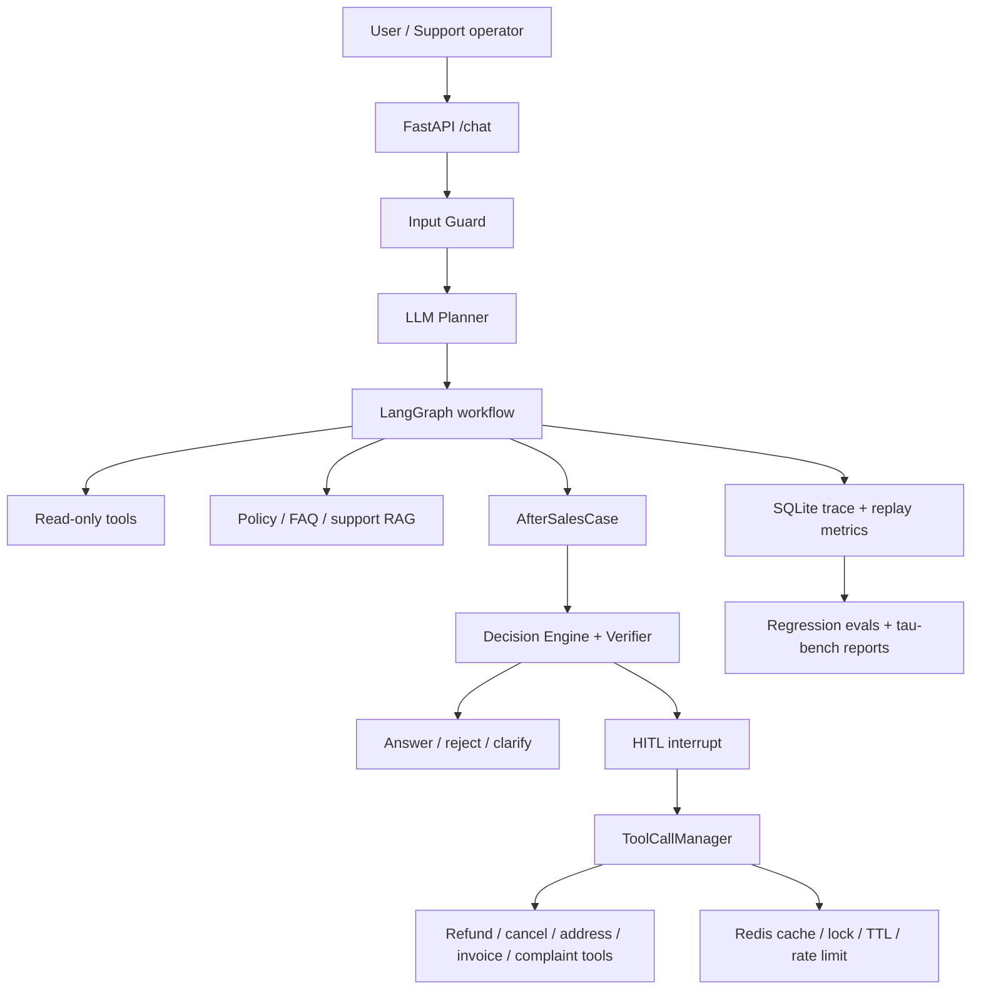

# commerce-support-agent

An e-commerce customer support and after-sales operations agent built around case resolution, governed tool execution, workflow-constrained RAG, HITL approval, audit traces, and tau-bench retail evaluation.

The project focuses on a concrete business workflow: a support agent or after-sales operator receives a customer request, asks the agent to inspect order facts and policies, and lets the system decide whether to answer, clarify, reject, auto-handle a low-risk case, or pause for human approval before any write action.

## Highlights

- **Case-resolution workflow**: order status lookup, policy Q&A, category risk analysis, after-sales priority reports, refunds, cancellations, address changes, invoices, and complaint escalation.
- **LangGraph execution graph**: `plan_tasks -> select_next_task -> extract_slots -> retrieve_context -> execute_read_task/build_after_sales_case -> await_confirmation/finalize_escalation -> finalize_answer`.
- **Governed tool calls**: Pydantic schema validation, role/scope checks, tenant-aware cache, async execution, timeout/retry/backoff, fallback, redacted audit logs, Redis side-effect locks, and SQLite idempotency records.
- **Workflow-constrained RAG**: Olist order facts, category profiles, markdown policy/FAQ/merchant rules, ResCommons support corpus, BM25 + local VectorStore fusion, and optional Qdrant backend.
- **MCP boundary**: local MCP server for business tools, stdio/remote MCP client adapters, and a Stripe sandbox adapter for external side-effect integration.
- **Evaluation-first development**: unit/integration tests, offline task and retrieval evals, live LLM regression, LLM-as-judge smoke checks, bad-case regression, and tau-bench retail local run.

## Architecture



More diagrams: [docs/ARCHITECTURE_DIAGRAMS.md](docs/ARCHITECTURE_DIAGRAMS.md)

## Data

The repository keeps derived lightweight artifacts and download/build scripts. Large raw datasets are not committed.

| Source | Use |
|---|---|
| Olist Brazilian E-Commerce Public Dataset | 98,666 order facts and 73 category risk profiles |
| Bitext customer support dataset | intent mapping and multi-intent evaluation |
| ResCommons Full Ecom Chatbot Dataset | support corpus and hybrid retrieval evaluation |
| V1rtucious Ecom Chatbot Test Set | tool/RAG/escalation profile cases |
| Local policy/FAQ/merchant rules | after-sales policy retrieval and decision grounding |

## Results

| Area | Result |
|---|---:|
| Unit/integration tests | 100 passed |
| Ruff | all checks passed |
| ResCommons retrieval | BM25 intent@1/intent@5 64%/81% -> hybrid 78%/91% |
| Category alias retrieval | realistic alias Top1 97.5% |
| Live LLM agent regression | 30/30 pass, p95 26.05s |
| LLM-as-judge smoke | 10/10 pass |
| tau2-bench retail local run | pass^1 91.23% on retail base split, 114 tasks |

tau2 evidence: [benchmark_runs/tau2_retail/last_summary.md](benchmark_runs/tau2_retail/last_summary.md)

Full metrics: [evaluation/agent_metrics_report.md](evaluation/agent_metrics_report.md)

## Quick Start

```bash
uv sync --extra dev
uv run python scripts/download_olist_data.py
uv run python scripts/build_olist_dataset.py
uv run python scripts/build_bitext_dataset.py
uv run --extra data python scripts/download_rescommons_parquet.py
uv run --extra data python scripts/build_rescommons_dataset.py
uv run python -m pytest -q
uv run uvicorn app.main:app --reload
```

Open:

```text
http://127.0.0.1:8000/
```

Optional OpenAI-compatible LLM configuration:

```text
OPENAI_API_KEY=your-key
OPENAI_BASE_URL=https://api.deepseek.com
OPENAI_MODEL=deepseek-v4-flash
```

Docker Compose starts the app with Redis and Qdrant:

```bash
docker compose up --build
```

## Example Requests

```text
帮我查一下订单 203096f03d82e0dffbc41ebc2e2bcfb7 的状态
```

```text
退款补偿能不能直接承诺？
```

```text
生成售后运营风险日报，列出优先跟进类目和订单
```

```text
查订单 203096f03d82e0dffbc41ebc2e2bcfb7 状态，并说明退款政策，然后生成售后升级话术
```

## Repository Layout

```text
app/                 FastAPI app, LangGraph workflow, tools, MCP, RAG
benchmark_adapters/  tau2 retail adapter and guards
benchmark_runs/      persisted benchmark summaries
data/                derived sample data and local knowledge base
docs/                architecture, user manual, and bad-case regression notes
evaluation/          offline evals, live LLM evals, metrics reports
scripts/             data builders and benchmark launchers
tests/               unit and integration tests
```

## Documentation

- [User manual](docs/USER_MANUAL.md)
- [Architecture diagrams](docs/ARCHITECTURE_DIAGRAMS.md)
- [Bad-case regression notes](docs/BAD_CASE_REGRESSION.md)
- [Metrics report](evaluation/agent_metrics_report.md)

## Scope

This is a public-data project for a support and after-sales agent workflow. The production integration points are represented through MCP adapters, Redis runtime coordination, SQLite traces, and deterministic tool interfaces. Enterprise deployment would replace the Olist-backed services with internal OMS, CRM, payment, invoice, coupon, IAM, and observability systems.

## License

MIT
