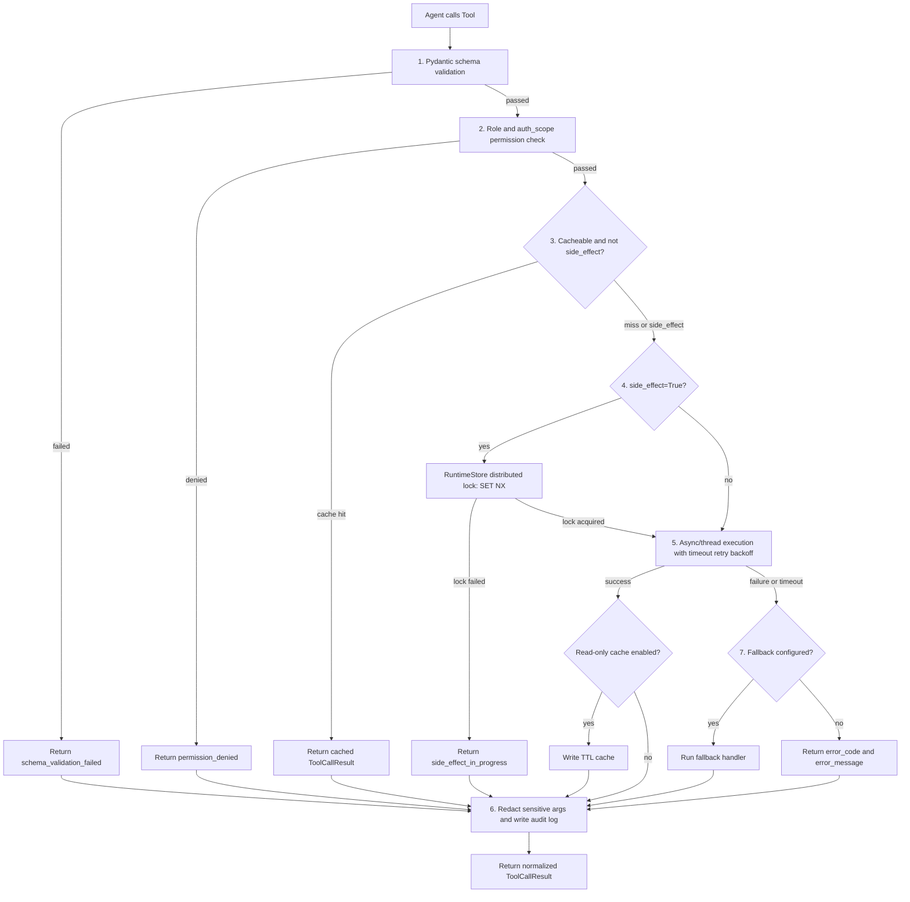
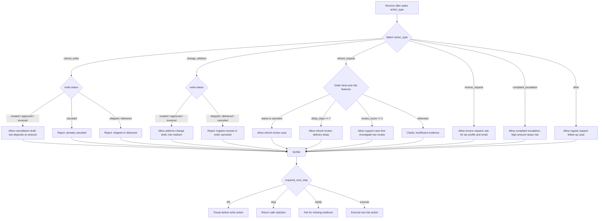
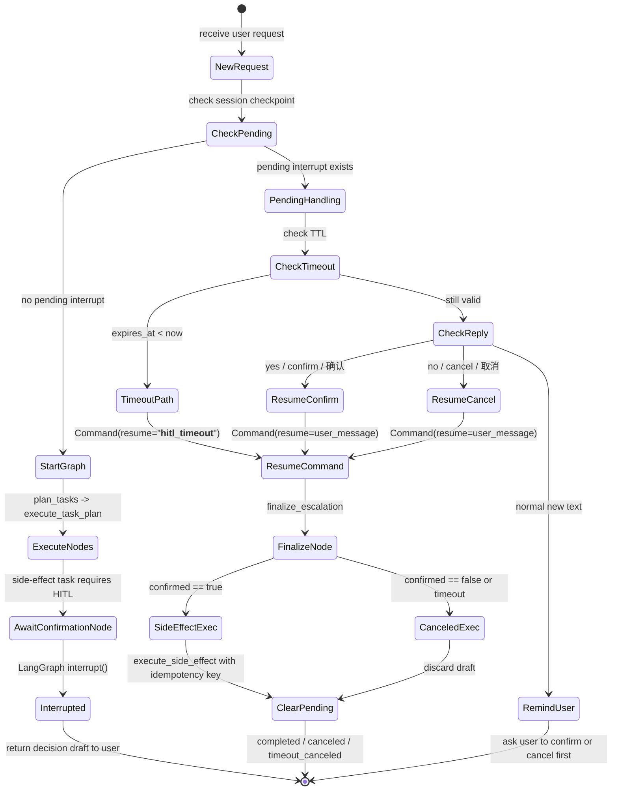
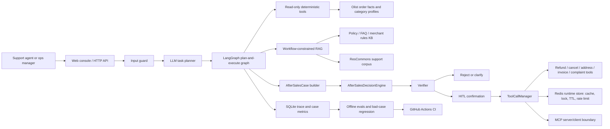
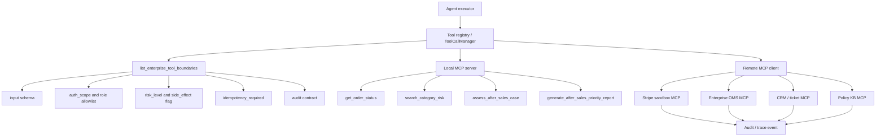
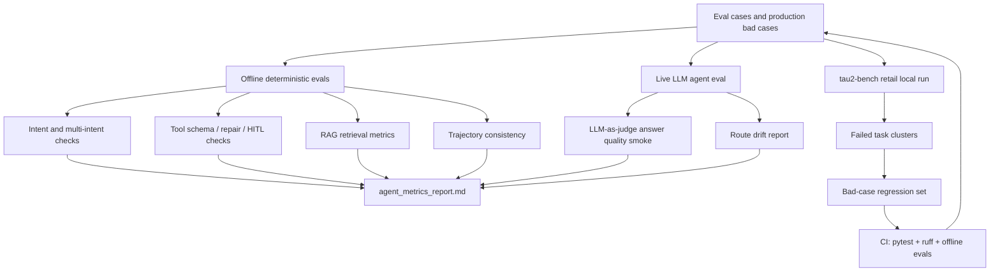
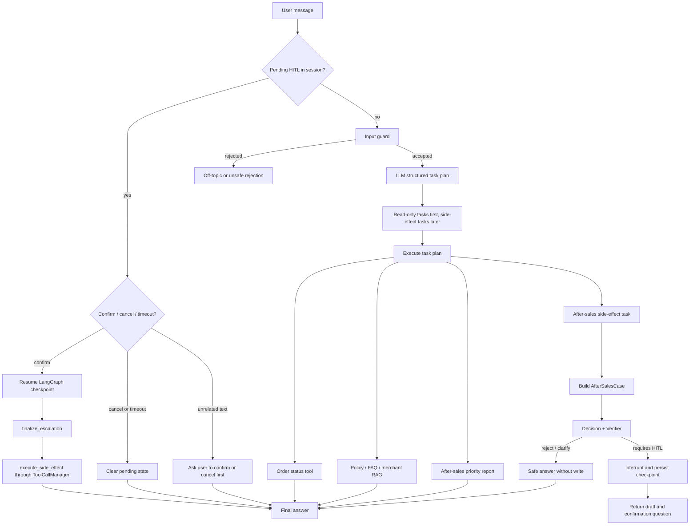

# Architecture Diagrams

这份文档把项目中最适合面试讲解的框架图集中导出。每张图都有独立 Mermaid 源文件，便于放进 README、PPT、GitHub 或 Mermaid Live Editor。

## 1. ToolCallManager 治理链路

源文件：`docs/diagrams/tool_call_manager.mmd`

这张图回答的是“Agent 调工具怎么生产化”。核心不是让模型直接调函数，而是在工具网关层集中处理 schema 校验、权限、缓存、锁、超时、重试、fallback、标准输出和审计。只读工具可以走 TTL cache；副作用工具不缓存，先抢分布式锁，再执行持久化幂等动作。面试里可以强调：LLM planner 不是最后一道安全边界，工具层才是能兜住错误参数、越权调用和重复写入的地方。

## 2. 售后 Case 决策链路

源文件：`docs/diagrams/after_sales_decision.mmd`

这张图说明为什么项目不是普通客服问答，而是 case resolution。LLM 可以理解用户说“我要退款”“我要投诉”，但是否能取消、是否能退款、是否要人工复核，不能由模型拍脑袋决定。决策层把 action_type、订单状态、延迟、评价、金额和政策命中转成结构化 outcome，再由 Verifier 决定下一步是 hitl、stop、clarify 还是 execute。

## 3. HITL 中断与恢复状态机

源文件：`docs/diagrams/hitl_resume_state.mmd`

这张图回答“为什么 HITL 不是简单弹窗”。真正的难点是 HTTP 请求结束后状态还要能恢复：LangGraph interrupt 挂起，checkpoint 保存上下文，Redis runtime store 保存 pending TTL。用户下一轮回复 yes/no 时，系统不是重新规划，而是 resume 到 finalize 节点；超时则用特殊 resume command 清理状态，避免悬挂副作用。

## 4. 项目整体业务架构

源文件：`docs/diagrams/overall_architecture.mmd`

这张图适合开场讲项目定位：它不是“LLM + 一个查询接口”，而是围绕售后 case 的受控执行链路。LLM 只处理不确定语言，订单事实、政策约束、风险判断、工具执行和副作用治理都由确定性模块接管。面试官问“业务价值在哪里”时，可以说：这个系统帮助客服坐席和售后运营主管把高风险售后处理流程标准化、可审计化、可回归评测。

## 5. MCP 企业工具边界

源文件：`docs/diagrams/mcp_enterprise_boundary.mmd`

这张图用来回答“MCP 写在技术栈里到底做了什么”。MCP 在这里不是多 Agent 通信，也不是 function calling 的替代品，而是企业工具边界：工具要能被发现、描述、授权、审计和替换。本项目的本地 MCP server 模拟企业 OMS/CRM/知识库工具，remote MCP client/Stripe adapter 演示外部 SaaS 接入形态。

## 6. 评测飞轮

源文件：`docs/diagrams/evaluation_flywheel.mmd`

这张图回答“怎么证明 Agent 有效”。项目不是只看最终回答，而是拆成意图、多意图、工具参数、RAG、轨迹、真实 LLM、LLM judge、tau2 benchmark 和 bad-case regression。尤其要强调：离线 100% 不能等价于模型能力；真实 LLM eval 和 tau2-bench local run 才是更接近 Agent 能力的证据。

## 7. 主执行链路

源文件：`docs/diagrams/agent_execution_chain.mmd`

这张图适合回答“用户一句话进来后到底发生了什么”。先检查 session 是否有 pending HITL，避免用户绕过确认状态；没有 pending 才进入 input guard、LLM planner、任务排序和执行。只读任务优先，副作用任务最后进入 case 决策和 HITL。这个设计的业务理由是：先拿事实和政策，再做动作，避免模型在事实不完整时先执行退款、取消或改地址。

## 总结口径

面试讲这组图时，可以按这个顺序：

1. 先讲整体架构：项目是售后 case resolution Agent，不是泛聊天。
2. 再讲主执行链路：LLM 做规划，工作流控制顺序和副作用边界。
3. 然后讲售后决策：退款/取消/改地址/发票/投诉升级都进入 `AfterSalesCase`。
4. 接着讲 HITL：中断、恢复、超时、幂等，不是一个普通确认弹窗。
5. 再讲 ToolCallManager：schema、权限、缓存、锁、重试、fallback、审计。
6. 最后讲 MCP 和评测飞轮：MCP 是企业工具边界，评测飞轮证明改动不会只靠主观感觉。

最重要的一句话是：**这个项目把 Agent 的“不确定语言理解”和企业系统的“确定性执行边界”拆开了，LLM 不直接决定退款/取消这类高风险动作，而是生成结构化计划，后续由业务规则、工具治理、HITL、幂等和审计共同约束。**
