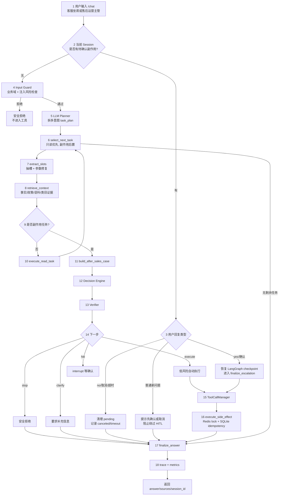
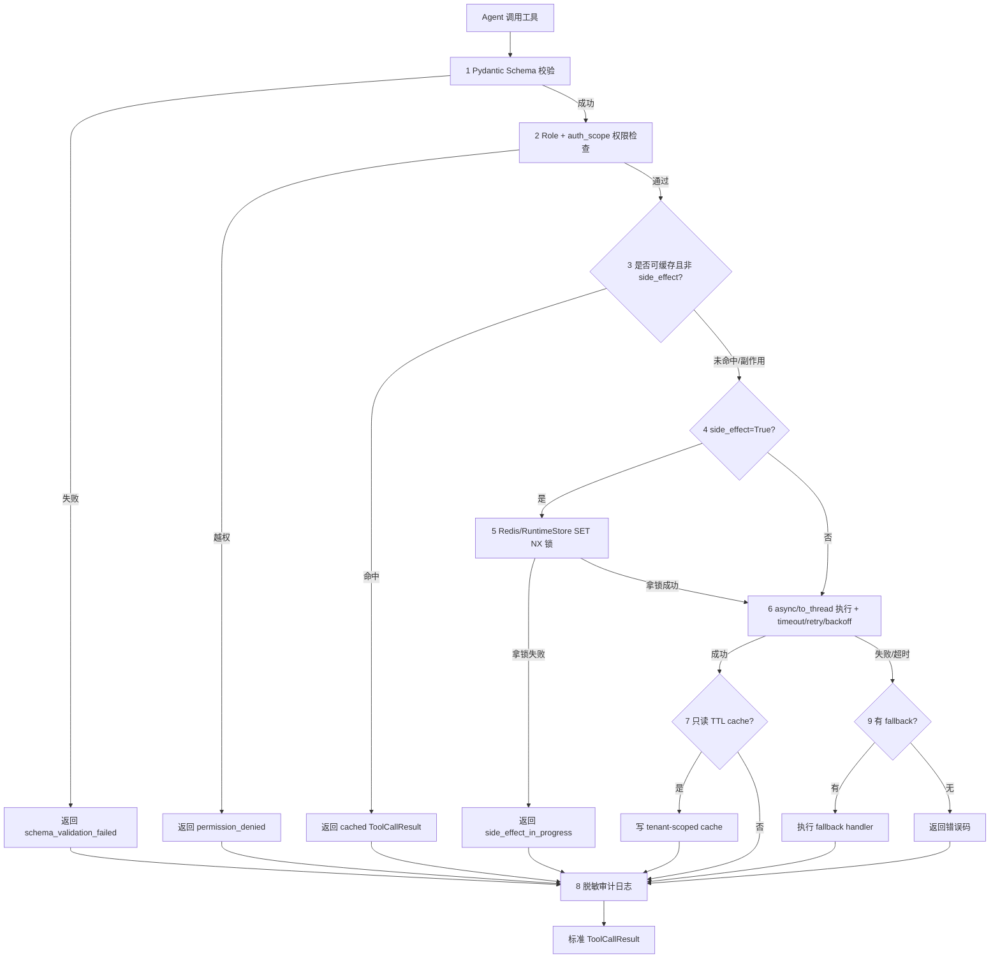
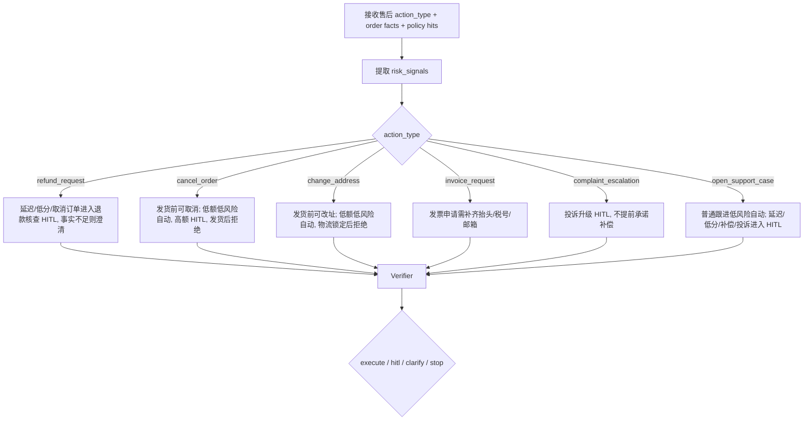
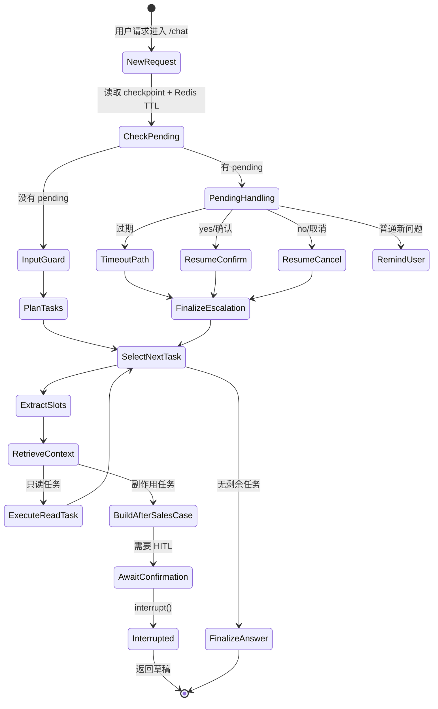
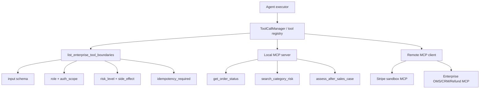
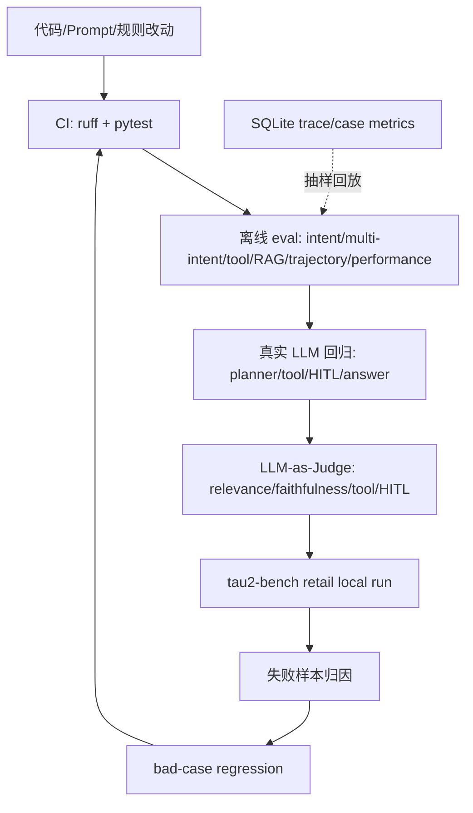

# Architecture Diagrams

这份文档集中保存项目核心 Mermaid 架构图。所有图都和当前代码链路对齐，尤其是 LangGraph 已拆成显式节点：`plan_tasks`、`select_next_task`、`extract_slots`、`retrieve_context`、`execute_read_task`、`build_after_sales_case`、`await_confirmation`、`finalize_escalation`、`finalize_answer`。

## 1. 一张图讲完整主链路

源文件：`docs/diagrams/agent_execution_chain.mmd`

每条线代表一次真实状态迁移：pending 检查防止绕过 HITL，planner 负责拆任务，select 节点保证只读先执行，retrieve 节点统一拉证据，售后副作用进入 `AfterSalesCase -> Decision -> Verifier`，写动作必须通过 ToolCallManager 和幂等存储。

## 2. ToolCallManager 治理链路

源文件：`docs/diagrams/tool_call_manager.mmd`

当前工具调用框架覆盖 schema、role、scope、tenant cache、异步执行、超时重试、fallback、审计和 side-effect lock。副作用工具不缓存，最终幂等记录落 SQLite case store。

## 3. 售后 Case 决策链路

源文件：`docs/diagrams/after_sales_decision.mmd`

当前 Olist 数据能直接支撑订单状态、金额、延迟、低分和政策命中，因此这些字段进入真实判断；`risk_signals` 预留了已退款、部分退款、优惠券/积分、疑似滥用等企业常见字段，当前公开数据没有这些事实来源时按安全默认值处理。低风险自动执行门禁已经落地，完整售后风控需要接入企业真实退款、支付、会员和风控事实。

## 4. HITL 中断与恢复

源文件：`docs/diagrams/hitl_resume_state.mmd`

用户确认后恢复到 `finalize_escalation`，执行已保存的草稿动作；取消或超时则清理 pending；执行后继续跑剩余任务。

## 5. MCP 企业工具边界

源文件：`docs/diagrams/mcp_enterprise_boundary.mmd`

MCP 在项目里承担企业工具接入边界。它暴露工具 schema、权限、风险等级、幂等要求和审计语义；生产环境可以把本地 Olist/SQLite 工具替换成企业 OMS、CRM、退款、发票、优惠券 MCP server。

## 6. 评测飞轮

源文件：`docs/diagrams/evaluation_flywheel.mmd`

评测飞轮分层证明项目能力：单测和离线 eval 证明确定性模块稳定；真实 LLM 回归证明模型进入主链路后可用；LLM-as-Judge 看回答质量；tau2-bench retail 给出第三方客服环境的横向指标。

## 总结

项目把自然语言理解和企业执行边界拆开：LLM 生成结构化计划，业务规则、RAG、工具治理、HITL、Redis 锁、SQLite 幂等和 trace 共同保证售后动作可控、可审计、可评测。
