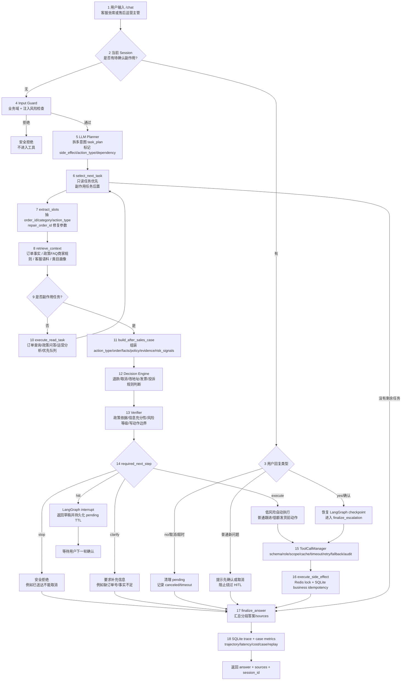

# 面试完整主链路图

这份文档对应当前代码里的真实主链路，适合面试时从“用户一句话”讲到“业务写动作执行”。当前 LangGraph 主链路显式拆成：`plan_tasks -> select_next_task -> extract_slots -> retrieve_context -> execute_read_task/build_after_sales_case -> await_confirmation/finalize_escalation -> finalize_answer`。

源文件：`docs/diagrams/interview_main_chain_zh.mmd`

## 每段链路怎么讲

1. `/chat` 收到用户自然语言，用户可以是客服坐席，也可以是售后运营主管。请求里带 `tenant_id/user_id/role/auth_scopes/session_id`，这些字段会进入 `AgentState`，后续工具调用用同一份上下文做限流、权限、缓存隔离和审计。
2. 系统先查当前 session 是否有 pending HITL。存在 pending 时，只接受确认、取消或超时恢复，普通新问题会被挡住，防止用户绕过待确认的退款/取消/改地址动作。
3. 没有 pending 时进入 Input Guard。这里检查业务域和注入风险，越界请求不会触达任何订单、政策或写工具。
4. LLM Planner 生成结构化 `task_plan`。每个任务包含 `intent/text/side_effect/action_type/depends_on`，多意图请求会拆成多个任务，例如“查订单、说明政策、申请退款”。
5. `select_next_task` 负责调度顺序。只读任务优先执行，副作用任务后置；如果副作用依赖订单查询，前置任务失败会阻断后续写动作。
6. `extract_slots` 把自然语言里的订单号、类目和售后动作抽成结构化字段，并用 `repair_order_id` 修复空格、大小写、前缀和多 ID 等常见非法参数。
7. `retrieve_context` 统一拉证据：订单事实走精确工具，政策/FAQ/商家规则走 KB 检索，客服历史语料走 hybrid retrieval，类目画像走 category rewrite/overlap 检索。
8. 只读任务进入 `execute_read_task`，生成订单状态、政策回答、运营分析或售后优先队列报告。只读任务结束后回到 `select_next_task` 继续跑剩余任务。
9. 副作用任务进入 `build_after_sales_case`，形成 `AfterSalesCase`。这个对象记录 action_type、order facts、policy refs、evidence、risk_signals、decision、verification 和 customer_reply。
10. Decision Engine 根据订单状态、金额、延迟、低分、政策命中和风险信号判断结果。当前支持 `approve/reject/needs_human_review/ask_clarification`。
11. Verifier 把决策转换成下一步：`execute/hitl/clarify/stop`。低风险普通跟进或低额发货前动作可以自动执行；退款、投诉、延迟低分、金额高、政策不足等进入 HITL 或安全出口。
12. HITL 使用 LangGraph `interrupt()` 挂起，checkpoint 保存完整状态，Redis 保存 pending TTL。下一轮用户回复 yes/no 时通过 `Command(resume=...)` 回到 `finalize_escalation`。
13. 写动作统一进 ToolCallManager。工具层做 Pydantic schema 校验、role + auth_scope 权限检查、tenant cache、side-effect lock、timeout/retry/backoff/fallback、输出标准化和脱敏审计。
14. `execute_side_effect` 使用 Redis/RuntimeStore 锁防并发，用 SQLite case store 保存业务粒度幂等记录。重复确认返回 duplicate，不重复创建退款单或工单。
15. `finalize_answer` 汇总多任务分段答案和 sources，`record_trace` 写入 SQLite trace，`case_metrics` 可按 case 统计自动解决率、HITL 率、错误写拦截、policy hit rate、工具错误率、延迟和成本。

## RAG 检索具体怎么做

| 检索对象 | 主链路位置 | 当前策略 | 为什么这样做 |
|---|---|---|---|
| 订单事实 | `retrieve_context -> get_order_status` | 精确 order_id 查询 | 订单状态、金额、评价、延迟是强事实，不能靠相似度猜 |
| 政策/FAQ/商家规则 | `retrieve_context -> search_policy_knowledge` | markdown 分段、query 扩展、title/text overlap、source_type rerank | 需要可解释来源，适合短 SOP/FAQ/规则文档 |
| 客服历史语料 | `retrieve_context -> search_support_examples` | BM25 + char/hash VectorStore + RRF 风格融合 | 解决相似问法和话术模式泛化，默认本地可复现，可切 Qdrant |
| 类目画像 | `retrieve_context -> search_category_risk` | exact -> token overlap -> adaptive rewrite | 处理 `health_beauty`、`health beauty`、中文别名、口语化类目名 |

政策 KB 的检索单元来自 `data/knowledge_base/*.md` 的标题分段，每个 hit 带 `section_title/source/source_type/text/score`。客服历史语料来自 ResCommons train split，test split 只用于评测，避免把测试样本放回语料库造成指标虚高。类目画像来自 Olist 全量订单离线聚合，返回类目名、平均支付金额、延迟率、低分率、取消率、样例订单和处理建议。

## 评测具体怎么做

| 层级 | 评什么 | 代表指标 |
|---|---|---|
| 单测/集成测试 | 主链路、MCP、RAG、ToolCallManager、Redis runtime、HITL、幂等、trace、tau summary parser | `pytest 100 passed` |
| 离线业务 eval | intent 映射、多意图拆解、工具参数修复、RAG 召回、真实轨迹结构、性能 | intent/multi-intent/task/tool repair/policy retrieval/performance |
| RAG 对比 | 不同检索策略是否真的提升召回和排序 | Top1、Recall@3、MRR、intent@1、intent@5 |
| 真实 LLM 回归 | LLM 进入 planner、抽槽、guard、answer 后是否仍跑通 | task_exact、tools_used、HITL correctness、answer checks、latency、cost |
| LLM-as-Judge | 回答相关性、事实一致性、工具正确性、HITL 正确性 | relevance/faithfulness/tool correctness/HITL correctness |
| tau2-bench retail | 第三方客服环境的 tool-use、policy compliance、副作用执行 | pass^1、DB match、read/write action match、NL assertions、p95、cost |

面试时要主动区分：离线 eval 用来保证确定性模块和回归不退化；真实 LLM eval 用来验证模型进入主链路后的端到端效果；tau2-bench 是外部 benchmark local run，用来做横向可比，不属于 Olist `/chat` 生产请求路径。

## 30 秒口播

这个项目是电商售后 case resolution Agent。用户一句话进来后，系统先查 session 是否有未确认副作用，再做安全检查；LLM 只负责拆任务、抽槽、query rewriting 和生成表达。订单事实、政策检索、类目风险、售后决策、Verifier、HITL 和写工具执行都在 LangGraph 显式节点里完成。退款、取消、改地址、发票、投诉等动作会先构造成 `AfterSalesCase`，通过规则决策和 Verifier 后，低风险动作自动执行，高风险动作 interrupt 等人工确认。所有工具经过 ToolCallManager/MCP 边界治理，Redis 做缓存、限流、锁和 HITL TTL，SQLite 保存 checkpoint、trace 和幂等 case。项目用单测/离线 eval/真实 LLM 回归/LLM judge/tau2-bench retail 来证明链路有效。
