# 面试完整主链路图

这份文档用来讲“这个电商客服/售后运营 Agent 如何从一句用户话跑到最终执行”。它比 `INTERVIEW_SIMPLE_DIAGRAMS.md` 更完整，覆盖主执行、RAG 分支、副作用治理、工具边界和评测闭环。

源文件：`docs/diagrams/interview_end_to_end_chain_zh.mmd`

```mermaid
flowchart TD
    U[用户输入<br/>自然语言: 查订单/问政策/申请退款/运营分析] --> G[Input Guard<br/>业务域与注入风险检查]
    G -- 越界/注入 --> Reject[安全拒绝<br/>不进入业务工具]
    G -- 通过 --> Planner[LLM Planner<br/>拆意图/抽槽/标记 side_effect/生成 task_plan]

    Planner --> OrderRead[Read-only 任务优先执行<br/>订单事实/政策/RAG/运营画像]
    OrderRead --> FactTool[订单事实工具<br/>OlistService 精确查询 order_id/status/payment/review]
    OrderRead --> RagRoute{RAG 数据源选择}
    RagRoute --> PolicyKB[政策/FAQ/商家规则 KB<br/>Markdown sections]
    RagRoute --> SupportCorpus[客服历史语料<br/>ResCommons corpus]
    RagRoute --> CategoryIndex[类目画像<br/>73 个 category risk profile]

    PolicyKB --> PolicyRecall[Query 扩展 + 词项召回<br/>title/text overlap]
    PolicyRecall --> PolicyRerank[轻量 rerank<br/>source_type + intent boost]
    SupportCorpus --> HybridRecall[Hybrid retrieval<br/>BM25 + char-ngram similarity baseline]
    HybridRecall --> HybridFuse[RRF 风格融合 rerank]
    CategoryIndex --> CategoryRewrite[类目 query rewriting<br/>exact -> token overlap -> adaptive rewrite]

    FactTool --> Evidence[结构化证据池<br/>facts/policy_refs/support_docs/category_insights]
    PolicyRerank --> Evidence
    HybridFuse --> Evidence
    CategoryRewrite --> Evidence

    Evidence --> Executor[Executor<br/>按依赖执行 task_plan, read-only 先于 side-effect]
    Executor --> CaseBuild{是否售后副作用?}
    CaseBuild -- 否 --> AnswerGen[LLM/模板答案生成<br/>必须基于证据回答]
    CaseBuild -- 是 --> Case[AfterSalesCase<br/>action_type/order/facts/policy/evidence/risk]

    Case --> Decision[Decision Engine<br/>退款/取消/改地址/发票/投诉规则判断]
    Decision --> Verifier[Verifier<br/>政策一致性/信息充分性/风险等级校验]
    Verifier --> Outcome{下一步}
    Outcome -- reject --> SafeReject[安全拒绝<br/>说明依据, 不执行写工具]
    Outcome -- clarify --> Clarify[要求补充信息<br/>缺订单号/事实不足/政策不满足]
    Outcome -- hitl --> HITL[HITL interrupt<br/>返回草稿并持久化 pending state]

    HITL --> Resume{用户确认?}
    Resume -- no/超时 --> Cancel[取消/超时取消<br/>清理 pending]
    Resume -- yes --> ToolBoundary[ToolCallManager / MCP 边界]

    ToolBoundary --> Schema[Schema 校验]
    Schema --> Auth[角色权限/工具白名单]
    Auth --> Risk[风险等级与 side_effect 标记]
    Risk --> Lock[Redis/RuntimeStore<br/>幂等 key + 分布式锁 + TTL]
    Lock --> ToolExec[异步工具执行<br/>timeout/retry/backoff/fallback]
    ToolExec --> Audit[脱敏审计<br/>who/when/tool/args/result]
    Audit --> AnswerGen
    SafeReject --> AnswerGen
    Clarify --> AnswerGen
    Cancel --> AnswerGen

    AnswerGen --> Trace[SQLite Trace + Case Metrics<br/>trajectory/case_id/status/latency/cost]
    Trace --> UserResp[返回用户<br/>answer + sources + pending state]

    subgraph Eval[评测飞轮: 不进入线上请求路径]
        CI[代码/Prompt 改动] --> Unit[pytest/ruff/离线 eval]
        Unit --> Offline[意图/多意图/工具/RAG/轨迹/性能]
        Offline --> Live[真实 LLM 回归<br/>planner/tool/HITL/answer checks]
        Live --> Tau[tau2-bench retail local run<br/>pass^1/DB match/write action/NL assertions]
        Tau --> BadCase[失败样本归因<br/>沉淀 bad-case regression]
        BadCase --> CI
        Trace -. 抽样/回放 .-> Offline
    end
```

## 1. 面试口播主线

可以这样讲：

> 这个项目把电商售后问题拆成可执行的业务任务。LLM 负责理解自然语言、拆 intent、抽 order_id/action_type 和生成回答；订单事实、政策依据、售后决策、副作用动作、权限、幂等和审计进入确定性链路。只读任务会优先执行，退款、取消、改地址、发票、投诉升级这类副作用任务先构造成 `AfterSalesCase`，经过 Decision Engine 和 Verifier，再通过 HITL 确认后进入 ToolCallManager/MCP 企业工具边界执行。

这段话的重点是三个边界：

- **模型边界**：LLM 做语言理解和规划，不直接改业务状态。
- **工具边界**：所有工具调用都要过 schema、权限、缓存、锁、超时、fallback、审计。
- **评测边界**：tau2-bench 是外部评测适配器，不在 `/chat` 线上请求路径里；它用来验证同类客服 tool-use 和 policy compliance 能力。

## 2. RAG 检索具体怎么做

本项目按业务对象分三类处理 RAG 和检索。

| 检索对象 | 为什么这么做 | 当前实现 | 评测指标 |
|---|---|---|---|
| 订单事实 | 订单状态、金额、评价、配送延迟是强事实，不能靠相似度猜 | `OlistService` 精确查询订单事实 | Olist task eval、真实轨迹工具正确率、tau2 DB/action match |
| 售后政策/FAQ/商家规则 | 文档短、结构清晰，需要可解释来源 | `MarkdownKnowledgeBase` 把多份 markdown 按二级标题切段，query 扩展后做 title/text overlap 召回，再按 `source_type` 和意图词轻量 rerank | policy KB Top1、Recall@3、MRR@3 |
| 客服历史语料 | 表达变化大，用来补相似问法和话术上下文 | `HybridSupportRetriever`：BM25 候选召回 + char 4-gram similarity baseline + RRF 风格融合 | intent@1、intent@5、MRR@5、capability@1/@5 |
| 类目运营画像 | 类目名有下划线、英文、中文别名和口语扰动 | `exact_underscore -> token_overlap -> adaptive_rewrite` 三档对比 | category Top1、Recall@3、MRR@3、realistic_alias Top1 |

具体代码口径：

- 政策 KB：`app/olist/knowledge.py`
  - `_expand_query()` 把“退款、发票、投诉、美妆、商家”等中文业务词扩展成英文/业务同义词。
  - `search()` 先算 query tokens 与 section title/text 的 overlap。
  - `_rerank_score()` 根据 `policy/faq/merchant_rule` 和 query intent 做轻量 boost。
- 客服 hybrid retrieval：`app/retrieval/hybrid.py`
  - `bm25_search()` 使用倒排索引和 BM25 公式。
  - `vector_search()` 使用 char 4-gram overlap，作为低成本相似度 baseline。
  - `hybrid_search()` 先取 BM25 候选，再融合 BM25 rank 与 char-ngram rank，当前权重是 BM25 `0.2/(rank+20)`，char-ngram `2.0/(rank+20)`。
- 类目检索：`app/olist/retrieval.py`
  - exact 用来做最弱 baseline。
  - token overlap 解决 `health beauty` 与 `health_beauty` 的分词匹配。
  - adaptive rewrite 解决中文别名、行业俗称、英文近义表达。

面试时要主动补一句：

> 订单事实走精确工具查询，政策、FAQ、商家规则、历史客服话术和类目归一进入检索链路。当前客服语料使用本地 char-ngram 相似度 baseline，生产化可以替换为 Elasticsearch/BM25 + vector DB + cross-encoder reranker，评估口径保持 Recall@K、MRR、nDCG、latency 和 cost。

## 3. 评测具体怎么进行

评测分四层，不把所有数字混成一个“准确率”。

| 层级 | 评什么 | 怎么跑 | 当前代表指标 |
|---|---|---|---|
| 离线确定性评测 | intent 映射、多意图拆解、工具参数修复、RAG 召回、轨迹结构 | `python -m evaluation.agent_metrics_report` 汇总各 eval | pytest 89 passed；多意图 60/60；工具任务 245/245；policy KB 19 条 Top1/Recall@3/MRR@3 100% |
| RAG 对比评测 | 不同检索策略是否真的提升召回 | `evaluation/rag_retrieval_eval.py`、`evaluation/hybrid_retrieval_eval.py` | 类目 adaptive_rewrite Top1 92.08%、realistic_alias Top1 97.50%；ResCommons hybrid intent@1/intent@5 77%/91% |
| 真实 LLM 回归 | LLM 进入主链路后，planner、工具、HITL、回答是否一起工作 | `evaluation/live_agent_eval.py`，需要 API key，样本小但跑真实模型 | live Agent eval 30/30；p50 10830ms、p95 26052ms |
| 外部 benchmark | 是否能在第三方客服环境横向对比 | tau2-bench retail adapter，独立 Python 3.12 环境跑 | retail base split 114-task local run：pass^1 91.23%、DB match 92.11%、write action match 92.05%、NL assertions 95.08%、p95 32.77s |

各指标的含义：

- **Top1**：首位召回是否就是 gold，适合看“第一条证据能不能用”。
- **Recall@3 / intent@5**：TopK 内是否包含正确答案，适合看召回池有没有覆盖。
- **MRR@K**：正确项越靠前分越高，适合比较排序质量。
- **task_exact**：LLM 拆出来的任务序列是否和 gold 完全一致。
- **tools_used / action match**：是否调用了正确工具，以及参数和副作用动作是否正确。
- **DB match**：执行后环境数据库状态是否和 benchmark gold state 一致，这是副作用任务最硬的指标。
- **NL assertions**：自然语言回复是否满足任务要求，比如是否正确说明政策、有没有误承诺。
- **p95 latency / cost_per_case**：证明不是只会跑通，还关注线上成本和延迟。

## 4. 面试官追问时的边界说法

**问：RAG 为什么不用 embedding？**

答：项目按数据对象选择检索方式。订单事实需要精确一致性，走事实工具；政策和 FAQ 当前用可解释 lexical+rerank；客服历史语料用本地 hybrid baseline 验证 BM25 与相似度融合策略。生产环境接入大量 FAQ 和客服会话后，可以升级为 ES/BM25 + vector DB + cross-encoder reranker。

**问：这些评测能证明真实 Agent 能力吗？**

答：离线评测只能证明确定性模块和回归不退化，不能单独证明真实 Agent 能力。所以项目又跑了真实 LLM 回归和 tau2-bench retail。我的表述会区分三类数字：本项目业务 eval、真实模型回归、外部 benchmark local run，不把它们包装成同一种指标。

**问：tau2-bench 在主链路里吗？**

答：tau2-bench 运行在外部 benchmark adapter 中。主链路是 `/chat` 的 Olist Agent；tau2 adapter 接第三方 retail policy、tool set 和用户模拟器，用于横向验证 tool-use、policy compliance 和副作用治理能力。

**问：为什么不是全交给 ReAct？**

答：售后业务有副作用和政策边界，纯 ReAct 容易把“想一想”和“做动作”混在一起。这里用 plan-and-execute，把 read-only 任务排在前面，把副作用任务统一收敛到 `AfterSalesCase -> Decision -> Verifier -> HITL -> ToolCallManager`，可审计、可恢复，也更容易评测。

## 5. 30 秒版本

> 用户说一句话后，系统先做安全检查，再由 LLM 拆成多个业务任务。订单、政策、类目风险和客服历史分别走精确工具、政策 KB、类目 query rewriting 和 hybrid retrieval，形成证据池。只读任务先回答；退款、取消、改地址、发票和投诉升级会构造 `AfterSalesCase`，经过规则决策和 Verifier 后，必须 HITL 确认才能通过 ToolCallManager/MCP 调企业工具。每一步都会写 trace 和 case metrics；效果用离线 eval、真实 LLM 回归和 tau2-bench retail local run 三层验证。
