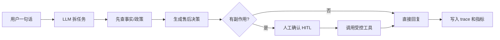
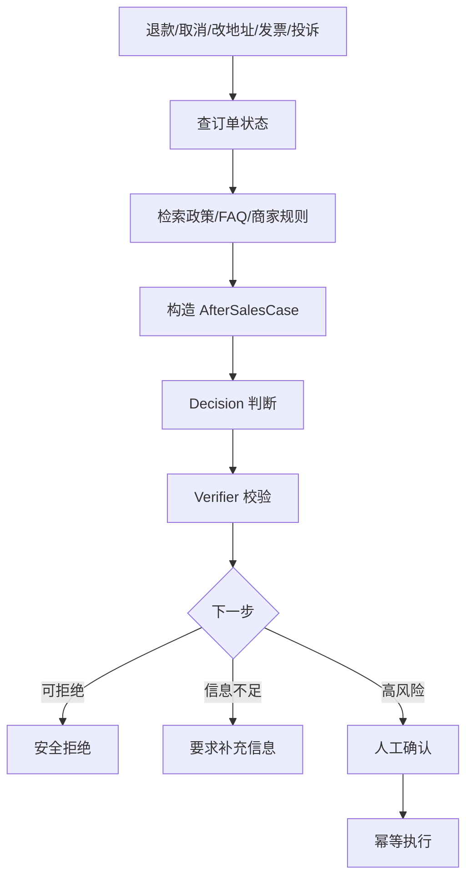
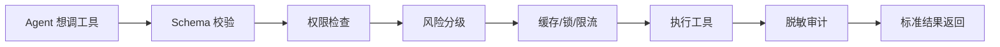
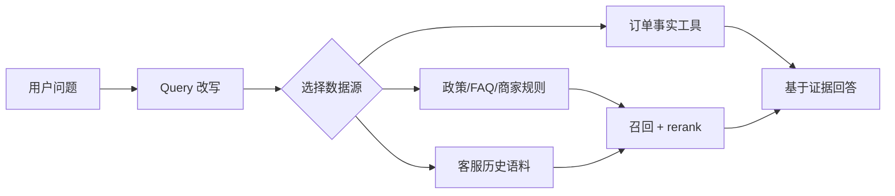
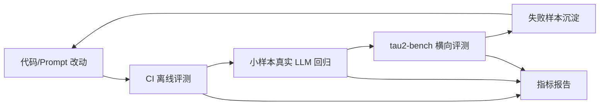

# 面试简洁链路图

这份是面试口播版，不追求覆盖所有模块，只追求让面试官快速听懂“这个 Agent 到底怎么工作、为什么不是普通聊天机器人”。

## 1. 主链路

源文件：`docs/diagrams/interview_main_chain_zh.mmd`

一句话解释：用户输入先由 LLM 拆成任务，但不是让模型直接退款或取消订单；系统先查订单事实和政策，再做售后决策，涉及副作用就停在 HITL，确认后才通过受控工具执行。

## 2. 售后 Case 链路

源文件：`docs/diagrams/interview_after_sales_case_zh.mmd`

一句话解释：所有售后动作先变成结构化 `AfterSalesCase`，再根据订单状态、延迟、金额、评价和政策依据判断能不能做、要不要人工确认、是否应该拒绝或澄清。

## 3. 工具边界

源文件：`docs/diagrams/interview_tool_boundary_zh.mmd`

一句话解释：工具不是裸函数，而是企业边界。每次调用都要过参数、权限、风险、缓存/锁/限流和审计，最后返回统一结构，方便追踪和回放。

## 4. RAG 链路

源文件：`docs/diagrams/interview_rag_chain_zh.mmd`

一句话解释：不是所有东西都塞向量库。订单走确定性事实工具，政策/FAQ/商家规则走文档检索，客服历史语料走 hybrid retrieval，最后回答必须基于证据。

## 5. 评测飞轮

源文件：`docs/diagrams/interview_eval_chain_zh.mmd`

一句话解释：每次改代码或 prompt，都先跑离线评测，再跑真实 LLM 小样本，关键能力用 tau2-bench 做横向验证，失败样本进入回归集。

## 面试推荐讲法

可以按这 5 句话讲：

1. 这个项目的核心不是聊天，而是售后 case resolution。
2. LLM 负责理解自然语言和拆任务，确定性系统负责事实、政策和副作用边界。
3. 退款、取消、改地址、发票、投诉都会先进入 `AfterSalesCase`，再由 Decision + Verifier 决定下一步。
4. 高风险动作必须 HITL，确认后通过 ToolCallManager/MCP 边界调用工具，并保证幂等和审计。
5. 效果不是靠主观感觉，而是用离线评测、真实 LLM 回归、tau2-bench 和 bad-case regression 持续验证。
