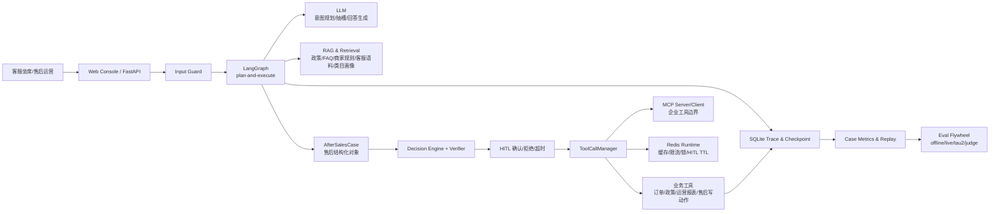

# 面试简易框架图

这张图用于面试开场，先讲清楚系统有哪些层，再展开主链路、RAG、HITL、工具治理和评测。

源文件：`docs/diagrams/interview_simple_framework_zh.mmd`

## 讲法

这个系统面向客服坐席和售后运营人员。入口是 Web Console 和 FastAPI，用户输入先经过 Input Guard，再进入 LangGraph 的 plan-and-execute 流程。LLM 负责意图规划、槽位抽取和回答生成；RAG 层提供政策、FAQ、商家规则、客服语料和类目画像证据；售后写动作统一构造成 `AfterSalesCase`，经过 Decision Engine、Verifier 和 HITL，再由 ToolCallManager 调用受治理的业务工具或 MCP 企业工具边界。Redis 负责短生命周期运行时协调，SQLite 保存 checkpoint、trace 和可回放记录，评测飞轮从 trace 和固定评测集持续验证规划、工具、RAG、HITL、回答质量和外部 benchmark 表现。

## 和完整主链路图的关系

- 这张图说明系统分层。
- `INTERVIEW_END_TO_END_CHAIN.md` 说明一次请求如何端到端执行。
- `ARCHITECTURE_DIAGRAMS.md` 说明 ToolCallManager、HITL、MCP、评测等模块的细节。
