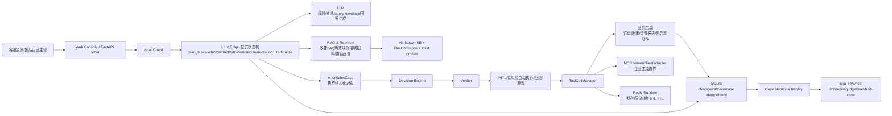

# 面试简易框架图

这张图用于面试开场，先讲清楚系统分层，再展开主链路、RAG、HITL、工具治理和评测。

源文件：`docs/diagrams/interview_simple_framework_zh.mmd`

## 开场讲法

这个系统面向客服坐席和售后运营主管。入口是 Web Console 和 FastAPI，用户输入先经过 Input Guard，再进入 LangGraph 显式状态机。LLM 负责规划、抽槽、query rewriting 和回答生成；RAG 层提供政策、FAQ、商家规则、客服历史语料和类目画像证据；售后写动作统一构造成 `AfterSalesCase`，经过 Decision Engine、Verifier 和 HITL/低风险自动执行门禁，再由 ToolCallManager 调用受治理的业务工具或 MCP 企业工具边界。Redis 负责短生命周期运行时协调，SQLite 保存 checkpoint、trace 和业务幂等记录，评测飞轮持续验证规划、工具、RAG、HITL、回答质量和外部 benchmark 表现。

## 一句话重点

这个项目把 LLM 的语言理解能力放在可控工作流里，用确定性事实工具、政策检索、售后决策、Verifier、HITL、幂等和审计约束真实业务动作。

## 面试展开顺序

1. 先讲业务：售后 case resolution，服务客服坐席和运营主管。
2. 再讲主链路：用户请求如何拆成多个任务，如何先读事实和政策，再处理写动作。
3. 然后讲售后决策：退款、取消、改地址、发票、投诉如何进入统一 case 生命周期。
4. 接着讲工具治理：schema、role、scope、cache、timeout、retry、fallback、Redis lock、audit。
5. 最后讲评测：100 passed、离线 eval、真实 LLM 回归、LLM-as-Judge、tau2-bench retail local run。
